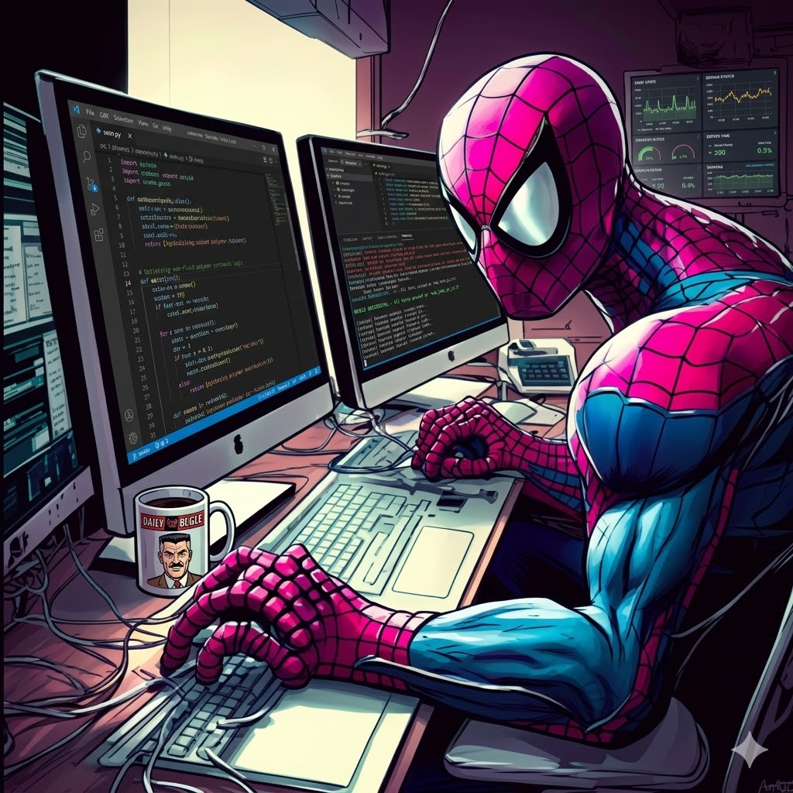

  
  <h2>Com grandes códigos vêm grandes responsabilidades 🕸️ | Adailson Rocha</h2>
  
<strong>Desenvolvedor Full-Stack</strong> especializado em arquiteturas web modernas e aplicações conteinerizadas.

###

  
  
  

###

## 👨‍💻 Sobre Mim

- 🏥 **Sistemas Críticos (Mission-Critical)**: Desenvolvimento e manutenção de tecnologias de alta disponibilidade para o **Setor de Saúde Pública**, atuando na engenharia de arquiteturas robustas onde falhas não são uma opção aceitável.
- 🕷️ **Web Scraping & Data Mining**: Especialista em automação de navegadores em larga escala, focado em superar sistemas avançados de detecção de bots (Stealth Plugins, rotação de User-Agent) e manipulação assíncrona de DOM para extrair dados estruturados de marketplaces e e-commerces complexos.
- 📊 **Engenharia de Dados (BI)**: Responsável pela criação de pipelines automatizados que transformam dados brutos da web em Inteligência de Negócio (Business Intelligence) acionável.
- 🚀 **Arquiteturas Full-Stack**: Construção de aplicações escaláveis utilizando **Next.js**, **NestJS** e **Python**, totalmente conteinerizadas com **Docker & Docker Compose**.
- 🧪 **Qualidade de Software**: Foco total em confiabilidade e performance ponta-a-ponta através de testes automatizados com **Vitest** e **Playwright**.
- 🎓 Formado em Matemática pelo Instituto Federal de Sergipe e graduando em Análise e Desenvolvimento de Sistemas pela Faculdade Descomplica Digital.

## 🛠️ Minhas Habilidades

<table width="100%">
  <tr>
    <td align="center" width="25%">
      <h3>🎨 Frontend</h3>
    </td>
    <td align="left" width="75%">
      
      
      
      
      
      
      
    </td>
  </tr>
  <tr>
    <td align="center">
      <h3>⚙️ Backend</h3>
    </td>
    <td align="left">
      
      
      
      
      
      
      
    </td>
  </tr>
  <tr>
    <td align="center">
      <h3>🗄️ Banco de Dados</h3>
    </td>
    <td align="left">
      
      
      
      
      
    </td>
  </tr>
  <tr>
    <td align="center">
      <h3>🧰 Infra & Ferramentas</h3>
    </td>
    <td align="left">
      
      
      
      
      
      
      
      
      
    </td>
  </tr>
</table>

###

  
  

 

  

 
